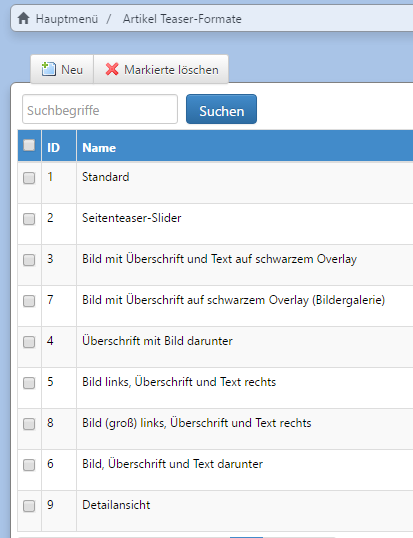

# Redaktionelles Artikelmodul

Mit dem redaktionellen Artikelmodul als Basis können Sie Teaser, Listen und Detailseiten ganz unterschiedlicher Artikeltypen wie News, Blog, Event, Video, Bildergalerie usw. zusammenstellen. So lassen sich z.B. themenbezogene Content-Listen generieren und an jeder beliebigen Stelle auf der Website platzieren.

Die Artikel lassen sich in Kategorien einteilen, die dann z.B. bestimmen können, unter welchem Navigationspunkt ein Artikel erscheint. Es ist sogar möglich, die Navigation oder Teile davon automatisch aus den Artikelkategorien generieren zu lassen.

## Artikeltypen


Artikel \(redaktionell\) → Artikeltypen


Jeder Artikel muss einem Artikeltyp zugeordnet sein. Der Artikeltyp bestimmt, welche Darstellung für den Artikel verwendet wird und welche Datenbankfelder aus pkg\_article für diesen Typ freigeschaltet sind. Alle anderen Felder werden dann beim Editieren des Artikels im Backend ausgeblendet. So können z.B. bei einem Artikel vom Typ _Magazin_ die Felder Herausgeber, Jahrgang, Heftnummer etc. angegeben werden, die aber bei einem Artikel vom Typ _News/Text_ nicht erscheinen. Wenn es unterschiedliche Artikeltypen gibt oder die Artikel sich stark unterscheiden, ist es sinnvoll, eine zusätzliche Tabelle mit den benötigten Feldern anzulegen und die Einstellung „enthält nur einen Datensatz“ zu aktivieren. Dann in der Artikeltabelle nur eine Eigenschaft für diese Tabelle anlegen. Außerdem kann für jeden Artikeltyp eine eigene Extension für das pkg\_article-Objekt angegeben werden.

In der Regel werden die Artikeltypen durch Ihren Dienstleister vorkonfiguriert.

## Artikelkategorien


Artikel \(redaktionell\) → Artikelkategoriegruppen


Das Artikel-Package kennt Artikelkategoriegruppen und Kategorien. Kategorien sind Eigenschaften der Artikelkategoriegruppen und können beliebig verschachtelt sein. Artikel werden immer Kategorien zugeordnet, nicht Artikelkategoriegruppen. Kategorie und Kategoriegruppe sind auch Teil des SEO-Links.

Legen Sie zuerst eine Artikelkategoriegruppe an, danach entsprechenden Kategorien.

Die Kategorien können verwendet werden, um Listen danach zu filtern und Artikel in die Navigation bzw. Breadcrumb einzubinden. Hierfür wird die Kategorie einer Seite im CMS zugewiesen über das Feld `Listen / Übersichtsseite`.

## Teaser

Es können verschiedene Teaser angelegt werden, die dann auf Artikel oder wahlweise auch auf eine CMS-Seite oder eine externe URL verweisen können. Für die Teaser kann ein Teaser-Format gewählt werden über das die Darstellung des Teasers bestimmt wird. Die Teaser-Formate können im Backend angelegt werden.


Artikel \(redaktionell\) → Artikel Teaser-Formate


Beispiele von Teaserformaten:

