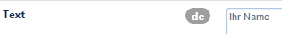
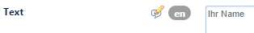
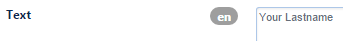
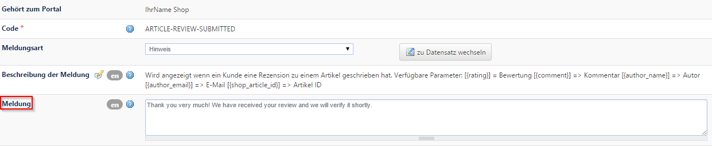

# Übersetzungen

> Ab CHAMELEON Version 6.1 steht eine komplett überarbeite Funktionalität der Mehrsprachigkeit zur Verfügung.

## CMS Webübersetzungen

\[nur gültig bis Chameleon Version 6.0\]

```text
CMS / Portal-Einstellungen → CMS Webübersetzungen
```

Dies ist die zentrale Stelle im CHAMELEON CMS, um alle im Frontend stehenden übersetzbaren Texte in andere Sprachen zu übersetzen.

| Bezeichnung | Beschreibung |
| :--- | :--- |
| **Key** | eindeutiger Schlüssel des zu übersetzenden Textes |
| **Text** | der zu übersetzende Text |
| **Hinweis** | Hinweistext |

Suchen Sie den Begriff, den Sie übersetzen wollen und öffnen diesen Datensatz.

Das Sprachflag beim Textfeld zeigt Ihnen an, in welcher Editiersprache Sie sich gerade im Backend befinden.



Stellen Sie nun auf die gewünschte Editiersprache um. Das zu übersetzende Feld ist durch das entsprechende Flag gekennzeichnet. Noch nicht übersetzte Felder erkennen Sie anhand des Bearbeitungsstiftes.



Übersetzen Sie den Text und speichern Sie den Datensatz.



## CMS Übersetzungen

\[nur gültig bis Chameleon Version 6.0\]

```text
CMS Admin → CMS Übersetzungen
```

Hier können Sie die Übersetzungen des CHAMELEON-CMS selbst, also die im Backend stehenden Texte, einsehen und bearbeiten. Diese Übersetzungen werden mitgeliefert. Falls später weitere Tabellen oder Datensätze hinzugefügt wurden, können Sie hier deren Übersetzung anlegen.

Diese Funktion steht in der Regel nur Administratoren zur Verfügung.

## Übersetzungen von Fehlermeldungen

```text
CMS / Portal-Einstellungen → Portale / Webseiten
```

Einige Systemmeldungen und Fehlercodes erscheinen auch im Frontend und sollten daher ebenfalls übersetzt werden \(Feld `Meldung`\)



