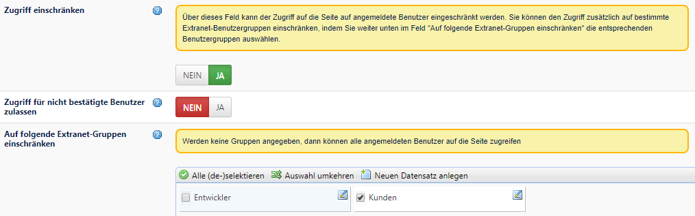
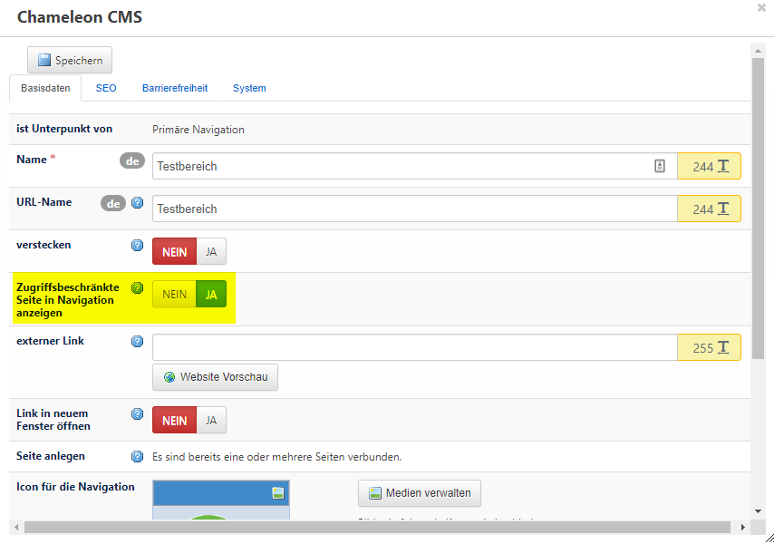

# Zugriff auf eine Seite einschränken

Der Zugriff auf eine Seite kann auf angemeldete Benutzer eingeschränkt werden. Gehen Sie dafür in die `Seiten-Einstellungen` und stellen Sie das Feld `Zugriff einschränken` auf JA. Zusätzlich kann hier der Zugriff auf bestimmte Extranet-Benutzergruppen \(z.B. Kundengruppen\) eingeschränkt werden, indem Sie weiter unten im Feld "Auf folgende Extranet-Gruppen einschränken" die entsprechenden Benutzergruppen auswählen.

  
 Ist die zugriffsbeschränkte Seite mit einem Navigationspunkt verbunden, wird dieser standardmäßig für nicht angemeldete Benutzer _nicht_ angezeigt. Soll die Seite dennoch in der Menüführung erscheinen, wählen Sie in der `Navigationsverwaltung` beim Feld `Zugriffsbeschränkte Seite in Navigation anzeigen` JA. Der Navigationspunkt ist nun im Frontend sichtbar. Um die Seite öffnen zu können, muss der Benutzer weiterhin angemeldet sein. Stellen Sie dazu sicher, dass in der Extranet-Konfiguration für "Zugriff verweigert" eine passende Login-Seite hinterlegt ist, auf die weitergeleitet werden kann.

