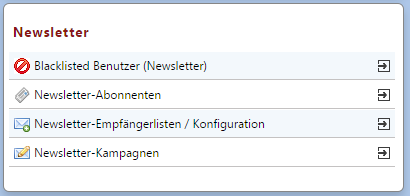

# Newsletter-Elemente



#### Blacklisted Benutzer

Die Liste der ```Blacklisted Benutzer``` ist eine Schutzliste mit den E-Mail-Adressen der Personen, die keine unaufgeforderte Werbung erhalten wollen. Sie dienen dem Kundenschutz vor unerwünschter Werbung. Seriöse Unternehmen verpflichten sich, dem Wunsch ihrer registrierten Kunden nach Werbefreiheit nachzukommen und sie nicht weiter zu kommerziellen Zwecken per E-Mail zu kontaktieren.
Die in der Liste hinterlegten E-Mail-Adressen werden beim Newsletter-Versand ausgeschlossen.

<br>

#### Newsletter-Abonennten

Hier werden die Abonnenten, die sich über das Anmeldeformular angemeldet haben, aufgelistet (auch diejenigen, deren Anmeldung noch nicht über den zugesandten Link bestätigt wurde; diese sind durch den Eintrag *Anmeldung wurde bestätigt*: *NEIN* zu erkennen). Jede Anmeldung ist einem bestimmten Kunden zugewiesen und kann eindeutig identifiziert werden. Der exakte Zeitpunkt der Anmeldung und die der Bestätigung kann hier ebenfalls abgelesen werden.

| **Name** | Beschreibung |
| -- | -- |
| **Gehört zum Kunden** | gibt an, zu welchem Kunden diese Newsletter-Anmeldung gehört |
| **Abonennten der Empfängerlisten** | eine Liste der Empfängerlisten, in welche der Kunde aufgenommen wurde |
| **Anmeldebestätigungen** | Liste der Newsletter, bei welchen der Kunde angemeldet ist |
| **E-Mail-Adresse** | E-Mail-Adresse, an die der Newsletter versendet werden soll |
| **Anmeldedatum** | Zeitpunkt, zu dem die Newsletter-Anmeldung erfolgte |
| **Anmelde Code** | interner Code zur Realisierung des Double-Opt-In-Verfahrens |
| **Anmeldung wurde bestätigt** | wird auf JA gesetzt, wenn der Kunde die Anmeldung bestätigt hat |
| **Datum der Anmeldebestätigung** | Zeitpunkt, wann die Anmeldung bestätigt wurde |
| **Abmelde-Code** | interner Code zur Realisierung des Double-Opt-Out-Verfahrens |

<br>


#### Newsletter-Empfängerlisten / Konfiguration

Eine Empfängerliste definiert sozusagen die Grundeinstellungen eines Versandes. Hier wird u.a. festgelegt, welche E-Mail-Adresse und welcher Name als Absender des Newsletters angegeben werden und an welche E-Mail-Adresse Antworten des Abonnenten gelangen.

Es sind unterschiedliche Empfängerlisten möglich. Durch die Anmeldeseite wird dem Newsletter-Benutzer eine bestimmte Empfängerliste zugeteilt oder der Benutzer darf selbst auswählen, welche(n) Newsletter er erhalten will.

<br>

####Newsletter-Kampagnen

Dies ist die zentrale Stelle, an welcher alle beteiligten Komponenten für den Versand eines Newsletters zusammen kommen. Eine Kampagne ist die Konfiguration mit allen benötigten Einstellungen für den Newsletter-Versand: Die Zuteilung des zu versendenden Newsletters und die restlichen Angaben werden durch Zuteilung der Empfängerliste zugeschrieben.


**<u>Basisdaten:</u>**

| Name | Beschreibung |
| -- | -- |
| **Titel des Newsletters** | Titel zur internen Identifizierung des Newsletters |
| **Betreff** | Betreff des Newsletters (wird als E-Mail-Betreff verwendet) |
| **Inhalt Text** | Inhalt für Plain-Text-E-Mails |
| **Portal** | Zugehörigkeit des Newsletters zu einem Portal |
| **gewünschter Versand-Zeitpunkt** | Zeitpunkt, an dem der Newsletter-Versand gestartet werden soll |
| **Newsletter-Templateseite** | die gestaltete Newsletter-Vorlage wird hier zugewiesen |
| **Newsletter-Versand aktiv** | JA markiert den Newsletter als versandfertig |
| **Benutzer-abhängige Newsletter generieren** | Wenn ja, wird für jede E-Mailadresse an die der Newsletter gesendet wird, ein personalisierter Newsletter generiert. Dass bedeutet, der Newsletter wird für jede E-Mailadresse neu generiert, was massiv die Performance beeinflusst. Wenn nein, wird der Newsletter nur einmal generiert und einzelne Texte wie z. B. Name oder Anrede werden für jede E-Mailadresse ersetzt. |
| **Empfängerliste** | alle Empfängerlisten für diesen Newsletter |

**<u>Kampagnenstatus:</u>**

| Name | Beschreibung |
| -- | -- |
| Warteschlangen-Einträge | In den Warteschlangen-Einträgen landet jede einzelne E-Mail, die bereits versendet wurde oder bereits zum Absenden bereit ist und nur noch auf den auszuführenden Cronjob wartet. Sie listet also jede tatsächlich zu versendende E-Mail auf, die einem bestimmten Abonnenten zugewiesen wurde. Anhand der Spalte ‘Versendet’ kann man ablesen, ob und wann der Newsletter versendet wurde. |
| Sendestatus | Hier wird der Sendestatus der Kampagne angezeigt |
| Versandbeginn | Startzeitpunkt des Newsletter-Versands |
| Versandende | Endzeitpunkt des Newsletter-Versands |


