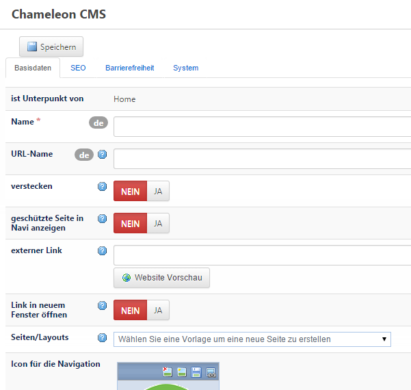

### Seite anlegen

Eine neue Seite können Sie entweder über die Navigationsverwaltung oder auch über die Seitenverwaltung (`Neu`) anlegen. Da in der Regel sowieso ein Navigationsknoten (= Menüpunkt) angelegt werden muss, empfiehlt es sich, die Seite bereits beim Einrichten des Menüpunktes in der Navigationsverwaltung mit anzulegen.

Klicken Sie mit der rechten Maustaste auf den Navigationspunkt, unter dem die neue Seite anlegt werden soll. Ferner klicken Sie auf `Neu`, um einen neuen Navigationspunkt anzulegen.

Es öffnet sich ein Dialog, bei dem u.a. folgende Angaben gemacht werden können:

| Bezeichnung | Beschreibung |
| -- | -- |
| Name | Titel der Seite |
| URL-Name | wird an die URL des darüberstehenden Knoten angehängt. Mit der so entstehenden URL kann die Seite im Browser aufgerufen werden. Standardmäßig wird der URL-Name automatisch aus der Eingabe im Feld ‘Name’ kopiert. Der URL Name kann anschließend aber auch verändert werden. |
| verstecken | chaltet die Seite unsichtbar. Wichtig: Die Seite wird nur in der Navigation nicht aufgeführt, ist aber über Eingabe der URL, wenn bekannt, erreichbar. |
| externer Link | Sie können anstatt einer lokalen Seite auch eine externe Website in ihrer Navigation verlinken. Wichtig: Geben Sie hierbei den vollen Link mit http:// an. |
| Seiten / Layouts | Wenn Sie hier ein Seitenlayout wählen, wird daraufhin automatisch eine Seite angelegt und mit diesem Navigationspunkt verknüpft. Der Seitentitel wird dabei aus dem Namen des Navigationspunkts übernommen und kann später geändert werden. |
| SEO | Im SEO Tab haben Sie die Möglichkeit, den Navigationspunkt von der Indizierung durch Suchmaschinen auszuschließen und Ausnahmeregeln zu definieren. So können Sie z.B. dafür sorgen, dass die Kontaktseite, die auf allen Seiten in der Footer-Navigation verlinkt ist, auf allen Seiten außer der Home-Seite als noFollow markiert wird und so Linkpower von dieser Seite nehmen. |

Jetzt geben Sie der neuen Seite einen Namen und wählen ein Layout für die Seite (dies ist wichtig, da der Navigationspunkt ansonsten ohne Seite erstellt wird, zu erkennen an der Kursivschrift). Der Navigationspunkt und eine damit verbundene Seite werden daraufhin angelegt. Im Rechtsklick-Menü der Navigationsverwaltung haben Sie diese Menüpunkte:

| Bezeichnung | Beschreibung |
| -- | -- |
| Verbundene Seiten | Listet alle Seiten auf, die mit dem Navigationspunkt verbunden sind. Verbindungen können, wie oben beschrieben, auch von mehreren Seiten zeitabhängig auf einen Navigationspunkt erfolgen. |
| Seite editieren | Führt zur Layout-Ansicht der Seite und damit zur Möglichkeit, die Seiten-Inhalte zu editieren. |
| Seiten-Einstellungen | Führt zur Seiten-Konfiguration, wo Einstellungen wie: Extranet Gruppe, Seiten-Titel, Bild-Meta-Tags und weitere Navigationspunkte vorgenommen werden können. |
| Navigation editieren | Öffnet den vorher beschriebenen Dialog mit den Optionen des Navigationspunkts. |
| Neu | Legt einen Navigationspunkt (+ evtl. Seite) an |
| Löschen | Löscht den Navigationspunkt. Wichtig: Es wird nur der Navigationspunkt gelöscht, nicht aber die Seite. Diese müssen Sie manuell in „Meine Webseiten“ löschen oder können diese mit einem anderen Navigationspunkt verbinden. |

