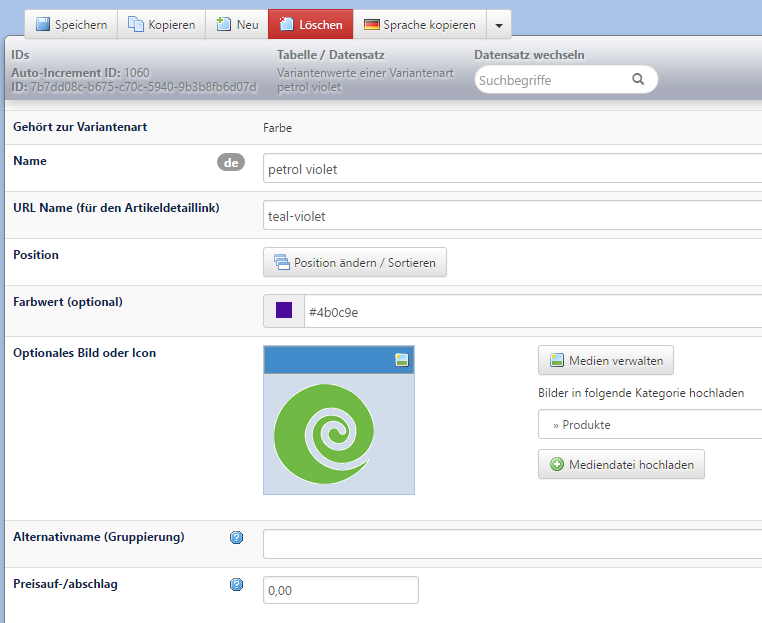
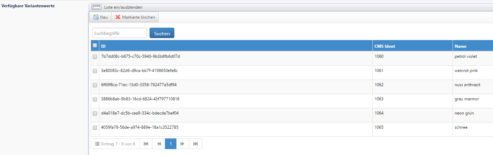

# Variantenwerte anlegen

Mit Klick auf `Neu` verlassen Sie jetzt die angelegte Variantenart und gelangen zu einer neuen Maske. Die Zugehörigkeit zur Variantenart _Farbe_ wird in der ersten Zeile angezeigt.

* `Name` des Variantenwerts: Tragen Sie den Wert der Variante ein, z.B. bei Farben den Wert _petrol violet_

Die weiteren Felder in dieser Maske wie z.B. `Preisauf-/abschlag` füllen Sie nach Bedarf aus.

  
 Wenn Sie einen Variantenwert gespeichert haben, können Sie gleich mit Klick auf `Neu` den nächsten Wert anlegen, Sie müssen nicht zurück in die Maske _Variantenart_ gehen.

  
 Die Variantenwerte können mit einem Namen, einem Bild, und einem Farbwert versehen werden.

Legen Sie so alle benötigten Variantenarten mit den dazugehörigen Variantenwerten an. Angelegte Variantenarten mit den dazugehörigen Werten werden automatisch unter `Artikel → Shop-Artikelvarianten` abgelegt.

Beachten Sie, dass die bei den Variantenarten hinterlegten Werte je Variantenset unabhängig voneinander sind, da die Werte einer Variantenart oder eines Sets im System eindeutig zuordenbar sein müssen. Wenn Sie z.B. 10 Farben bereits für eine Variantenart verwendet haben, müssen Sie diese Farben für ein weiteres Variantenset neu anlegen \(dabei dürfen Sie natürlich die gleichen Farben verwenden\).

