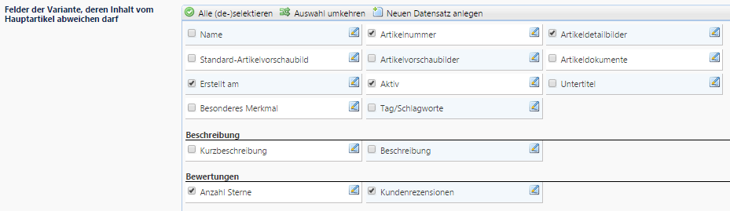

#### Variantenset anlegen

Legen Sie zunächst ein neues Variantenset an.

    Shop-Einstellungen → Variantensets

 
###### Füllen Sie die Felder wie folgt aus:
* `Name` des Variantensets: Vergeben Sie hier einen Namen, der die entsprechenden Varianten widerspiegelt, also z.B. *Größe und Farbe*
* `Felder der Variante, deren Inhalt vom Hauptartikel abweichen darf`: Setzen Sie bei denjenigen Feldern, die variantenspezifisch sein dürfen, ein Häkchen. Die Werte dieser Felder dürfen also von denen des Parent-Artikels (=Hauptartikel) abweichen.

 

 

* `Anzeigemanager` für die Variantenauswahl im Shop: bestimmt, wie die Variantenarten und –werte im Shop angezeigt werden. Momentan verfügbar: *Selectboxen*

 

 

`SPEICHERN` Sie zunächst, bevor Sie die Variantenarten anlegen.

* `Variantenarten des Variantensets`: Legen Sie hier die verschiedenen Variantenarten des Artikels mit den zur Verfügung stehenden Werten fest. In unserem Beispiel gibt es die 2 Variantenarten *Größe* und *Farbe*.

Klicken Sie auf `Neu` – Sie gelangen nun in eine neue Maske, sh. nächster Abschnitt.

