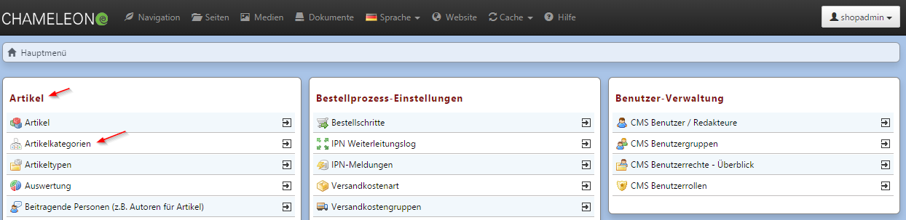

# Verwendete Browser

## Verwendete Browser

Im Frontend gehen wir \(falls nichts anderes während der Projektplanung vorgegeben\) davon aus, dass die Benutzer grundsätzlich Browser der neuesten Generation verwenden. Wir bitten Sie, für das Backend ebenfalls einen Browser der aktuellen Generation zu nutzen \(vorzugsweise Chrome oder Mozilla Firefox\).

## Test- und Live-Umgebung

Änderungen sollten grundsätzlich immer zuerst im Testsystem vorgenommen und getestet werden. Nach erfolgreicher Abnahme werden sie per Deploy \(= Kopieren des kompletten Ist-Standes des Dateisystems einer Entwicklungsversion\) auf das Live-System überspielt. Die Datenbank und kundenprojektspezifische Mediadaten wie Bilder und Downloads, werden dabei nicht überspielt. Änderungen, die im Livesystem ebenfalls dargestellt werden sollen, müssen daher dort erneut ins Backend eingegeben werden.

## Datenbackup

Die projektspezifischen Daten \(s.o.\) werden standardmäßig im Live-System jede Nacht vollständig gesichert, wobei immer das Backup des Vortages überspielt wird. Sollten einmal Daten versehentlich vom Anwender gelöscht werden, so kann nur eine komplette Version des Vortages zurückgespielt werden. Bei Datenverlust muss daher unmittelbar am selben Tag das Backup aufgespielt werden.

## Backend

Anwender sollten mit individuellen Zugängen Arbeiten am Backend vornehmen, da ein paralleles Arbeiten mit demselben Zugang nicht möglich ist \(automatischer Logout der „älteren“ Session\).

Menüpunkte im Backend werden in dieser Dokumentation wie folgt aufgeführt:

```text
Artikel → Artikelkategorien
```



Zahlreiche Hilfestellungen finden Sie in der kontextsensitiven Hilfe, gekennzeichnet durch .

